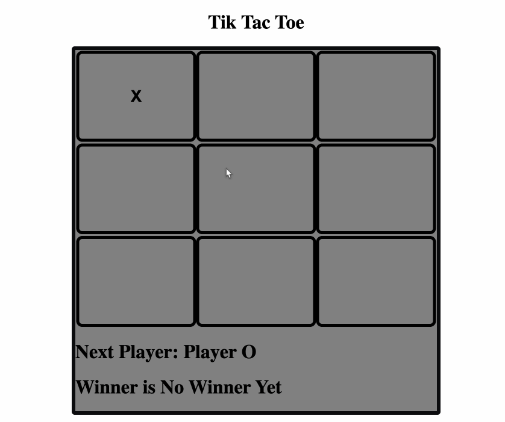

# TicTacToe
This Tic Tac Toe game project was completed using REACT with following features.
- The game can be played by two players in the same brower. (No single player mode.)
- The game keeps track of the players' turn and displays on the bottom of the game board.
- Winner will be also display on the bottom of the game board.

# How to run
To run this project, First download the files to your computer. 
Then, open terminal at the folder you saved the files and run the following code:
% http-server -c-1
Lastly, direct to http://localhost:8080 on your browser.
If the page is not shown, try http://localhost:8080/index.html. Or https://aseank.github.io/TicTacToe/

